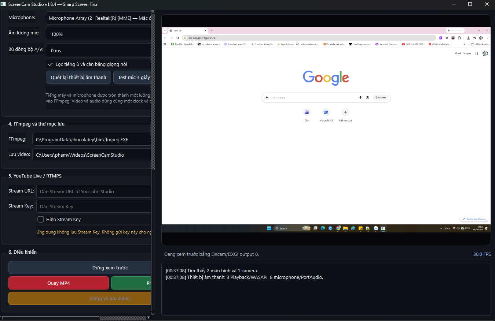

# ScreenCam Studio

[](#requirements)
[](#requirements)
[](#quality-profiles)
[](#project-status)

A Windows desktop application for recording a selected monitor, overlaying a webcam, capturing system audio and microphone input, and streaming to RTMP/RTMPS services such as YouTube Live.

ScreenCam Studio is built with Python, PySide6, DXcam/MSS, OpenCV, WASAPI loopback, and FFmpeg. It is designed for creators who need a lightweight, inspectable recording pipeline with explicit control over monitor selection, audio sources, output quality, synchronization, and diagnostics.

> **Current stable source release:** v1.8.4 — Sharp Screen Final
> **Supported platform:** 64-bit Windows 10 and Windows 11



> The screenshot path above is a placeholder. Add an application screenshot at `docs/images/screencam-studio.png` before publishing the repository.

## Highlights

* Select a specific monitor in a multi-monitor Windows setup.
* Record the desktop with an optional webcam overlay.
* Choose the webcam position, size, and mirror mode.
* Capture Windows playback audio through WASAPI loopback.
* Capture microphone audio independently and mix it with desktop audio.
* Test microphone signal before recording.
* Record MP4 files with constant-frame-rate output.
* Stream to RTMP or RTMPS endpoints, including YouTube Live.
* Use DXcam for high-performance capture or MSS for compatibility fallback.
* Choose native-resolution, YouTube, smooth-motion, or master-quality profiles.
* Generate a diagnostics JSON report for every recording.
* Detect timeline drift, audio underflow, missing microphone signal, repeated frames, and output-format mismatches.
* Recover interrupted or partially finalized recordings with included recovery scripts.
* Run on CPython 3.11 or newer, including Python 3.13.

## Why this project exists

Many recording tools hide the capture, audio, timing, and encoding pipeline behind a large configuration system. ScreenCam Studio takes a smaller and more transparent approach:

* A shared session clock coordinates video and audio.
* Screen frames are timestamped before encoding.
* Desktop audio and microphone input are captured independently.
* Recording quality profiles are defined in code and can be audited.
* Each recording produces machine-readable diagnostics.
* The project can be studied, modified, and extended without depending on a proprietary SDK.

ScreenCam Studio is not intended to replace every OBS Studio feature. It currently focuses on reliable single-scene screen recording, webcam overlay, audio mixing, and basic livestreaming.

## Features

### Screen capture

* Individual monitor selection.
* Multi-monitor coordinate support.
* DXcam/Desktop Duplication capture on compatible systems.
* MSS fallback for browser video, compatibility, or driver-specific issues.
* Constant-frame-rate output at 30 or 60 FPS.
* Native-resolution recording to avoid unnecessary scaling.
* Bicubic scaling and light desktop sharpening when scaling is required.

### Webcam

* Optional webcam overlay.
* Four-corner positioning.
* Adjustable overlay size.
* Mirror mode.
* Separate webcam capture thread so a slow camera does not block desktop capture.
* Webcam is composited after desktop sharpening to preserve camera appearance.

### Audio

* Windows playback capture using WASAPI loopback.
* Independent microphone selection.
* Multiple microphone backend options when exposed by Windows.
* Per-source volume controls.
* Desktop audio and microphone mixing at 48 kHz stereo.
* Silence insertion during source underflow to preserve the master timeline.
* Microphone signal test and peak-level reporting.
* Optional A/V offset compensation for fixed device latency.

### Recording and streaming

* MP4 recording with H.264 video and AAC audio.
* RTMP/RTMPS streaming.
* YouTube-compatible H.264 4:2:0 livestream output.
* Hardware encoder support when available:

  * NVIDIA NVENC
  * Intel Quick Sync Video
  * AMD AMF
* CPU encoding fallback using `libx264`.
* Safe finalization and recording recovery utilities.

### Diagnostics

Each completed recording can produce a file such as:

```text
screen_recording_2026-07-26_14-30-15-123.diagnostics.json
```

The report may include:

* Capture backend.
* Encoder name.
* Requested and actual resolution.
* Target and actual FPS.
* Wall-clock duration.
* Audio and video stream durations.
* A/V duration difference.
* Capture interval percentiles.
* Encoder write latency.
* Repeated-frame ratio.
* Desktop audio peak level.
* Microphone peak level.
* Audio underflow counts.
* Output pixel format and codec profile.
* Final `PASS` or `WARNING` quality status.

## Quality profiles

| Profile          | Output                            | Recording format         | Recommended use                                     |
| ---------------- | --------------------------------- | ------------------------ | --------------------------------------------------- |
| Stable           | 1280×720, 30 FPS                  | H.264 4:2:0, CRF/CQ 20   | Lower-end systems                                   |
| Sharp YouTube    | 1920×1080, 30 FPS                 | H.264 4:2:0, CRF/CQ 17   | Standard Full HD YouTube videos                     |
| Native Sharp     | Native monitor resolution, 30 FPS | H.264 4:2:0, CRF/CQ 16   | Recommended for screen recording                    |
| Smooth Motion    | 1920×1080, 60 FPS                 | H.264 4:2:0, CRF/CQ 17   | Fast scrolling or motion-heavy content              |
| Sharp YouTube 2K | 2560×1440, 30 FPS                 | H.264 4:2:0, CRF/CQ 16   | 1440p uploads                                       |
| MASTER UI/Text   | Native monitor resolution, 30 FPS | H.264 4:4:4, CRF 14, CPU | Editing masters, code, spreadsheets, and small text |

### Recommended profile

For most screen recordings:

```text
Profile: Native Sharp — native monitor resolution / 30 FPS
Encoder: Auto — prefer hardware encoder
Capture backend: DXcam
```

Use the MASTER UI/Text profile only when maximum local text clarity is more important than file size, CPU usage, and playback compatibility.

> Increasing the output resolution does not recreate detail that is absent from the source monitor. A native 1920×1080 recording is normally sharper than a 2560×1440 file created by upscaling a 1920×1080 desktop.

## Requirements

* Windows 10 or Windows 11, 64-bit.
* Standard 64-bit CPython 3.11 or newer.
* Python 3.13 is supported.
* FFmpeg and FFprobe from the same build.
* A webcam and microphone are optional.
* A supported GPU is optional; CPU encoding is available as a fallback.

Native dependency support for future Python versions depends on wheel availability from PySide6, OpenCV, DXcam, NumPy, and PyAudioWPatch.

## Quick start

### 1. Clone the repository

```powershell
git clone <YOUR_REPOSITORY_URL>
cd ScreenCamStudio
```

### 2. Install FFmpeg

Place both executables in:

```text
tools/ffmpeg.exe
tools/ffprobe.exe
```

Alternatively, add FFmpeg and FFprobe to the Windows `PATH`.

The repository should not bundle third-party FFmpeg binaries by default. Users or release maintainers are responsible for obtaining a build and complying with its license.

### 3. Run the application

To use a specific installed Python version:

```bat
run.bat 3.13
```

Other examples:

```bat
run.bat 3.11
run.bat 3.12
```

Without an argument, the launcher attempts to find a compatible 64-bit Python installation:

```bat
run.bat
```

The launcher creates an isolated environment at a short Windows path such as:

```text
%LOCALAPPDATA%\SCS\v184\py313
```

This avoids Windows path-length errors while installing PySide6 QML components.

### 4. Run the self-test

```bat
self_test.bat
```

Review the generated test report before reporting capture, codec, or synchronization problems.

## Manual development setup

The batch launcher is recommended on Windows, but contributors can set up the environment manually:

```powershell
py -3.13 -m venv "$env:LOCALAPPDATA\SCS\dev\py313"
& "$env:LOCALAPPDATA\SCS\dev\py313\Scripts\Activate.ps1"
python -m pip install --upgrade pip setuptools wheel
python -m pip install -r requirements.txt
python check_runtime.py
python main.py
```

Runtime dependencies:

```text
PySide6>=6.10,<7
mss>=10,<12
numpy>=2.1,<3
opencv-python>=4.12,<5
PyAudioWPatch>=0.2.12.8,<0.3
dxcam==0.3.0
```

## Usage

### Record a video

1. Select the monitor to record.
2. Choose DXcam or MSS as the capture backend.
3. Select a quality profile.
4. Choose a webcam or disable the webcam overlay.
5. Select a Windows playback device for desktop audio.
6. Select a microphone and run the microphone test.
7. Start preview and verify the selected monitor and webcam composition.
8. Start recording.
9. Stop recording and wait for finalization to complete.
10. Review the MP4 and its diagnostics JSON file.

### Stream to YouTube Live

1. Create or open a stream in YouTube Studio.
2. Copy the RTMP/RTMPS server URL and stream key.
3. Enter both values in ScreenCam Studio.
4. Select a YouTube-compatible profile.
5. Start the stream.
6. Confirm the incoming preview in YouTube Studio before going public.

Never commit a stream key, paste it into an issue, or include it in screenshots and logs.

### Browser video compatibility

If browser video is black, frozen, or missing in the recording:

1. Stop preview.
2. Change the capture backend from DXcam to MSS.
3. Start preview again.
4. Record a short test clip.

Hardware acceleration, DRM-protected content, browser capture behavior, and GPU drivers can affect what desktop-capture APIs are allowed to see.

## Output files

A recording session may create:

```text
screen_recording_<timestamp>.mp4
screen_recording_<timestamp>.diagnostics.json
screen_recording_<timestamp>.recording.mp4
screen_recording_<timestamp>.recording.wav
```

Temporary `.recording.*` files are normally removed after successful finalization. They may remain after an interruption or recovery-worthy error.

Use the included recovery scripts when needed:

```text
recover_recording.bat
recover_mkv_to_mp4.bat
```

Do not delete temporary recording files until the final MP4 has been verified.

## Project structure

```text
ScreenCamStudio/
├── main.py
├── requirements.txt
├── run.bat
├── build_exe.bat
├── self_test.py
├── self_test.bat
├── check_runtime.py
├── recover_recording.bat
├── recover_mkv_to_mp4.bat
├── reset_environment.bat
├── enable_long_paths_admin.bat
├── OUTPUT_QUALITY_SPEC.md
├── PYTHON_COMPATIBILITY.md
├── TEST_CHECKLIST.md
├── SYNTHETIC_TEST_RESULTS.md
└── screencam_studio/
    ├── __init__.py
    ├── main_window.py
    ├── devices.py
    ├── capture.py
    ├── audio_loopback.py
    ├── encoder.py
    ├── session_clock.py
    ├── diagnostics.py
    ├── quality.py
    └── runtime_compat.py
```

### Module responsibilities

* `main_window.py` — PySide6 user interface and application state.
* `devices.py` — monitor, camera, FFmpeg, and device discovery.
* `capture.py` — screen and webcam capture, frame timestamps, composition, scaling, and preview.
* `audio_loopback.py` — WASAPI playback capture, microphone capture, buffering, resampling, and mixing.
* `encoder.py` — recording, streaming, FFmpeg command generation, finalization, and recovery behavior.
* `session_clock.py` — shared monotonic timeline for the recording session.
* `diagnostics.py` — FFprobe inspection and per-session quality reports.
* `quality.py` — recording profiles and output-quality definitions.
* `runtime_compat.py` — Python and native-module compatibility checks.

## Architecture overview

```text
DXcam or MSS ──> timestamped desktop frames ─┐
                                              ├─> compositor ─> video scheduler ─> FFmpeg video
OpenCV webcam ─> latest camera frame ─────────┘

WASAPI loopback ─> desktop audio buffer ──────┐
                                                ├─> PCM mixer ─> WAV/audio stream
Microphone input ─> microphone audio buffer ──┘

Shared SessionClock ─> video timeline + audio timeline + stop timestamp

Video + audio ─> final MP4 ─> FFprobe ─> diagnostics JSON
```

The recording path intentionally separates video scheduling from audio capture so temporary audio delays do not block desktop frame encoding.

## Building a Windows executable

Run the application at least once so dependencies are installed, then execute:

```bat
build_exe.bat
```

The output is created under:

```text
dist\ScreenCamStudio\
```

For a portable package, place FFmpeg and FFprobe in:

```text
dist\ScreenCamStudio\tools\ffmpeg.exe
dist\ScreenCamStudio\tools\ffprobe.exe
```

Before distributing a build, verify the licenses of all bundled third-party binaries and Python packages.

## Testing

Run:

```bat
self_test.bat
```

Then perform component tests in this order:

1. Screen only, 720p30, no webcam or audio.
2. Webcam only with a static desktop.
3. Desktop audio only.
4. Microphone only.
5. Desktop audio and microphone together.
6. A/V synchronization test at the beginning, middle, and end of a 60-second recording.
7. Browser video capture with DXcam.
8. Browser video capture with MSS.
9. Native-resolution recording.
10. MASTER 4:4:4 recording, if the system is powerful enough.
11. RTMP/RTMPS test using a private or unlisted stream.

A pull request that changes capture, audio, encoding, or finalization behavior should include updated self-test results and a sanitized diagnostics JSON sample.

## Troubleshooting

### PySide6 installation fails with a long-path error

Use `run.bat`, which creates the virtual environment under `%LOCALAPPDATA%\SCS`. If the problem remains, run:

```text
enable_long_paths_admin.bat
```

Run it as Administrator, restart Windows, and try again.

### Camera is not detected

* Close other applications using the camera.
* Verify Windows camera privacy permissions.
* Re-scan devices.
* Test another camera backend if available.
* Prefer a standard USB or integrated webcam mode supported by OpenCV.

### Desktop audio is missing

* Choose the playback device that is currently producing sound.
* Re-scan devices after connecting Bluetooth or HDMI audio.
* Verify the selected device is not suspended or disconnected.
* Test with a local audio source before testing a browser.

### Microphone is silent

* Run the three-second microphone test.
* Try the same microphone name under another backend.
* Verify Windows microphone privacy permissions.
* Check the Windows input level and mute state.
* Disable exclusive mode in Windows sound settings if the driver prevents shared access.

### Audio is late or early

Use A/V offset compensation only for a consistent fixed delay. Do not use it to hide drift that increases over time. Attach the diagnostics JSON when reporting persistent drift.

### Recording is blurry

* Prefer Native Sharp at the monitor's actual resolution.
* Avoid upscaling 1080p to 1440p unless the upload workflow specifically requires 1440p.
* Use MASTER UI/Text for local editing masters with small text.
* Verify that the final player is displaying the video at 100% scale.
* Check the diagnostics file for actual resolution, pixel format, and encoder profile.

### Preview is smooth but the file is not

Check:

* Repeated-frame ratio.
* Capture interval p95 and maximum.
* Encoder write p95 and maximum.
* Actual output FPS.
* GPU encoder availability.
* CPU and GPU utilization.

Try 1080p30 before 1080p60 or 4K.

## Known limitations

* Windows only.
* One desktop scene with one webcam overlay.
* No scene collection system.
* No chroma key.
* No source-specific filters beyond the current desktop and microphone processing.
* No advanced transition editor.
* No browser-source or media-source layer system.
* No plugin API yet.
* Hardware and driver behavior can vary significantly between systems.
* DRM-protected video may not be capturable.
* MASTER H.264 4:4:4 files may not play correctly in older players or hardware decoders.

## Project status

The project is suitable for testing, personal production, and community development, but it should currently be considered **beta software** because capture, audio, webcam, and hardware encoding depend on Windows drivers and device-specific behavior.

Use short test recordings before relying on the application for an important live event or long production session.

## Roadmap

Possible future improvements:

* Independent audio meters in the main interface.
* Noise suppression and compressor controls.
* Separate desktop and microphone tracks in the final file.
* Multiple scenes and transitions.
* Text, image, browser, and media overlays.
* Region or window capture.
* Hotkeys.
* Recording pause and resume.
* Simultaneous recording and livestreaming.
* Automatic hardware encoder benchmarking.
* Plugin or scripting API.
* Automated Windows CI builds.
* Signed release installers.
* Localization support.

Roadmap items are proposals, not commitments. Open an issue before beginning a large feature so the design can be discussed first.

## Contributing

Contributions are welcome.

### Recommended workflow

1. Fork the repository.
2. Create a focused branch:

```bash
git checkout -b fix/audio-sync
```

3. Make the smallest reasonable change.
4. Run `check_runtime.py` and `self_test.bat`.
5. Test the affected component on Windows.
6. Update documentation and diagnostics expectations when behavior changes.
7. Open a pull request with clear reproduction and verification details.

### Pull request checklist

* [ ] The change has a focused purpose.
* [ ] The application starts on a supported 64-bit Python version.
* [ ] `self_test.bat` passes or failures are explained.
* [ ] Capture/audio/encoder changes include real Windows testing.
* [ ] New dependencies are justified and pinned appropriately.
* [ ] No stream keys, private recordings, personal device names, or sensitive paths are included.
* [ ] Documentation has been updated.
* [ ] Temporary files and generated environments are not committed.

### Code style

* Use type hints where practical.
* Keep capture, audio, UI, and encoding responsibilities separated.
* Do not perform blocking device or FFmpeg operations on the UI thread.
* Use monotonic time for synchronization logic.
* Prefer explicit error messages over silent fallback.
* Preserve diagnostics when changing timeline behavior.
* Avoid logging secrets such as RTMP stream keys.

## Reporting bugs

Before opening an issue:

1. Run `self_test.bat`.
2. Reproduce the problem with a short recording.
3. Try both DXcam and MSS where relevant.
4. Test the microphone independently.
5. Remove private information from diagnostic files and logs.

Include:

* Windows version.
* Python version.
* Screen resolution and scaling percentage.
* GPU model and driver version.
* Selected capture backend.
* Selected quality profile.
* Selected encoder.
* Playback and microphone backend types.
* Reproduction steps.
* Sanitized diagnostics JSON.
* A short sample clip only when it contains no private content.

Do not include stream keys, account credentials, private conversations, or recordings that you do not have permission to share.

## Security and privacy

ScreenCam Studio captures highly sensitive sources: screens, microphones, webcams, and potentially livestream credentials.

* Review the selected monitor before recording.
* Close private applications and notifications.
* Treat stream keys like passwords.
* Do not include secrets in logs, issues, or pull requests.
* Review diagnostic files before sharing them.
* Use private or unlisted streams for testing.
* Download FFmpeg only from a source you trust.

By default, recording is intended to happen locally. Livestream data is sent to the RTMP/RTMPS endpoint configured by the user.

## License

This README is prepared for an **MIT-licensed** open-source release.

Third-party components retain their own licenses. In particular, the license obligations of FFmpeg depend on the exact build and configuration being distributed.

## Acknowledgements

ScreenCam Studio is built on the work of the following open-source projects:

* Python
* Qt for Python / PySide6
* FFmpeg and FFprobe
* OpenCV
* DXcam
* MSS
* NumPy
* PyAudioWPatch

Please support and follow the licenses of the upstream projects.

## Maintainers

* `<YOUR_NAME_OR_ORGANIZATION>` — project maintainer

Repository: `<YOUR_REPOSITORY_URL>`

## Open-source release checklist

Before making the repository public:

* [ ] Replace all `<PLACEHOLDER>` values in this README.
* [ ] Add an MIT `LICENSE` file or choose another explicit open-source license.
* [ ] Add a real application screenshot.
* [ ] Confirm `.gitignore` excludes environments, recordings, diagnostics, logs, stream keys, and build artifacts.
* [ ] Remove test recordings and personal device information.
* [ ] Verify no FFmpeg binary is committed unintentionally.
* [ ] Add `CONTRIBUTING.md`.
* [ ] Add `CODE_OF_CONDUCT.md`.
* [ ] Add `SECURITY.md`.
* [ ] Enable GitHub Issues and Discussions as appropriate.
* [ ] Create the first tagged release and attach checksums.
* [ ] Test installation on a clean Windows user account.

---

If ScreenCam Studio is useful to you, consider starring the repository, reporting reproducible bugs, and contributing improvements.
